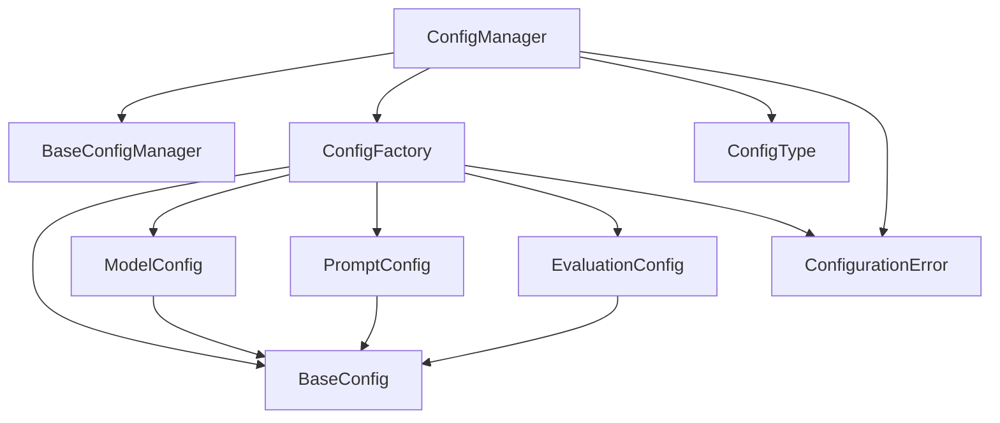
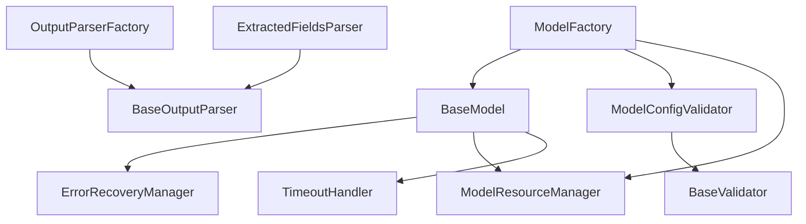
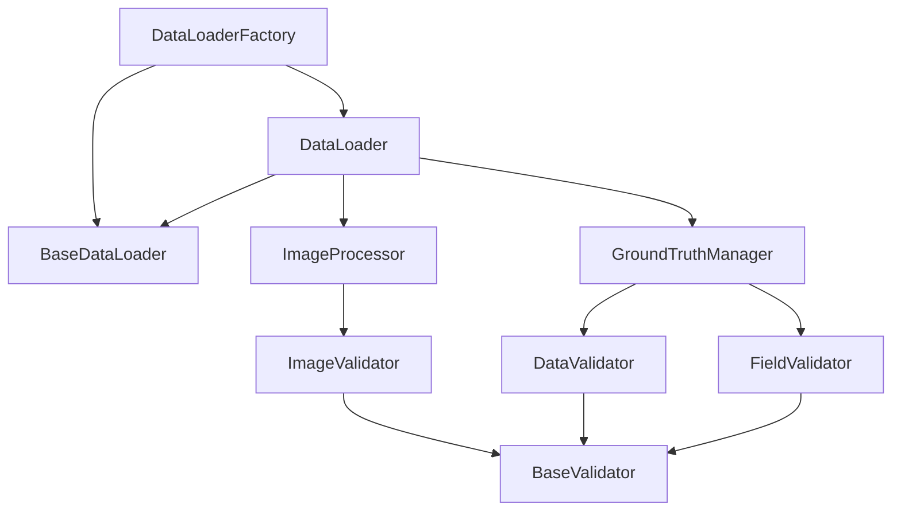

"""
# Component Dependency Graph Documentation

This document outlines the dependency relationships between major components in the system. The graphs are organized by subsystem and show both interface dependencies and concrete implementation relationships.

## Configuration System



## Model System



## Data Management System



## Key Dependency Patterns

### 1. Constructor Injection
All dependencies are passed through constructors. Example:
```python
class ConfigManager(BaseConfigManager):
    def __init__(self, config_root: str, config_factory: ConfigFactory):
        self._config_root = config_root
        self._config_factory = config_factory
```

### 2. Factory Pattern
Factories handle object creation and dependency wiring. Example:
```python
class ModelFactory:
    def create_model(self, name: str, config: BaseConfig) -> BaseModel:
        model = self.REGISTRY[name]()
        model.initialize(config)
        return model
```

### 3. Interface Dependencies
Components depend on interfaces rather than concrete implementations:
```python
class DataLoader(BaseDataLoader):
    def __init__(self, validator: BaseValidator):
        self._validator = validator
```

### 4. Resource Management
Resources are managed through dedicated components:
```python
class ModelResourceManager:
    def __init__(self):
        self._resources = {}
        
    def register_resource(self, name: str, resource: Any):
        self._resources[name] = resource
```

## Dependency Rules

1. **Maximum Dependencies**: No component should have more than 5 direct dependencies
2. **Interface Dependencies**: Always depend on interfaces, not concrete implementations
3. **Factory Creation**: Complex objects should be created through factories
4. **Resource Cleanup**: Components with resources must use appropriate resource managers
5. **Error Handling**: Each layer should handle its own errors appropriately

## Common Anti-patterns to Avoid

1. ❌ Global State or Singletons
   ```python
   # Bad
   _config_manager = None
   
   def get_config_manager():
       global _config_manager
       if _config_manager is None:
           _config_manager = ConfigManager()
       return _config_manager
   ```

2. ❌ Direct Concrete Dependencies
   ```python
   # Bad
   class Service:
       def __init__(self):
           self.config = ConfigManager()  # Direct instantiation
   ```

3. ❌ Circular Dependencies
   ```python
   # Bad
   from .config_manager import ConfigType  # Circular import
   from .base_config import BaseConfig
   ```

## Best Practices

1. ✅ Constructor Injection
   ```python
   # Good
   class Service:
       def __init__(self, config_manager: BaseConfigManager):
           self._config_manager = config_manager
   ```

2. ✅ Interface-Based Design
   ```python
   # Good
   class BaseService(ABC):
       @abstractmethod
       def process(self) -> None:
           pass
   ```

3. ✅ Factory Pattern
   ```python
   # Good
   class ServiceFactory:
       def create_service(self, config: BaseConfig) -> BaseService:
           return ConcreteService(config)
   ```

## Testing Dependencies

The dependency structure enables easy testing through mocking:

```python
@pytest.fixture
def mock_config_manager():
    return Mock(spec=BaseConfigManager)

def test_service(mock_config_manager):
    service = Service(config_manager=mock_config_manager)
    service.process()
    mock_config_manager.get_config.assert_called_once()
```
""" 